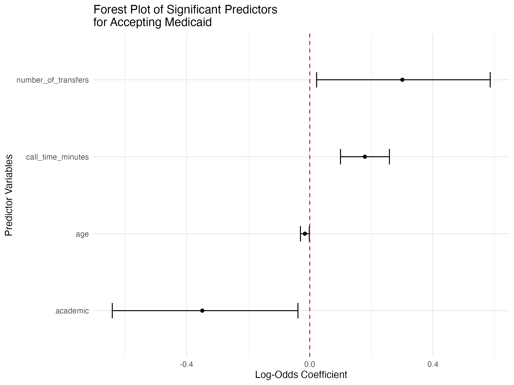
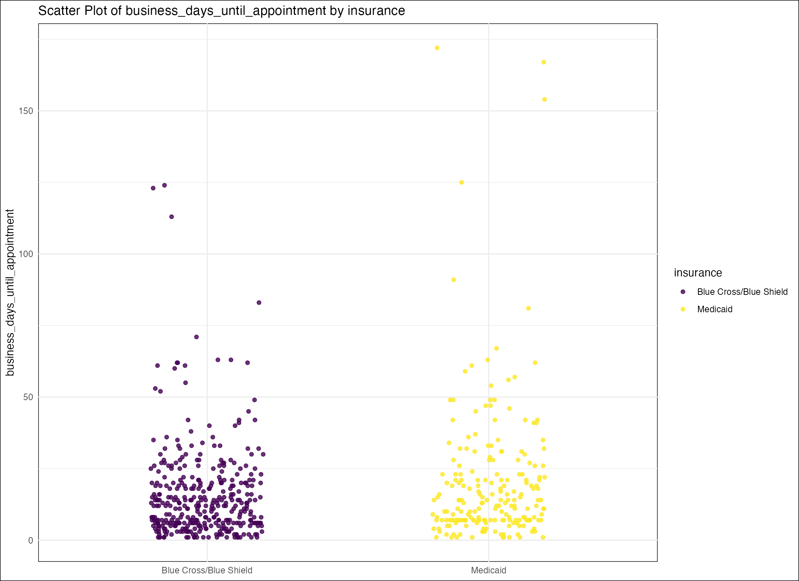
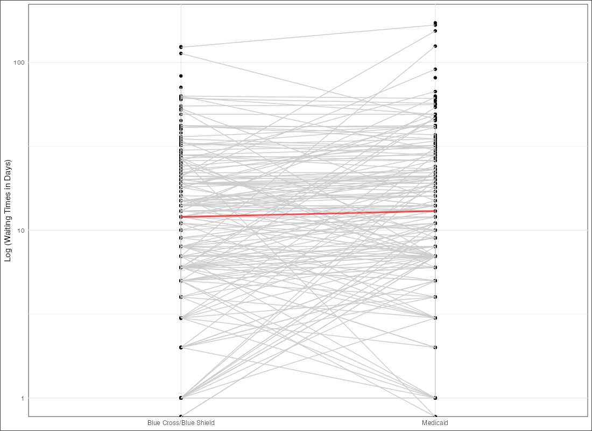

# Warning: This project is under active development. Contributions are welcome! 
# Please help improve this package by submitting issues (https://github.com/mufflyt/tyler/issues)
# and pull requests (https://github.com/mufflyt/tyler/pulls).

<!-- badges: start -->

<!-- badges: end -->

The **`tyler`** package provides a suite of tools for conducting **mystery caller studies** and facilitating **workforce distribution research** for obstetrics and gynecology (OBGYN) professionals. It streamlines the process of retrieving and analyzing National Provider Identifier (NPI) data, demographic information, and healthcare access data, while also offering resources for examining OBGYN residency programs.

Key Features
 - **Mystery Caller Studies**: Tools to analyze patient access to healthcare by searching for and processing NPI numbers based on names and other criteria.
 - **OBGYN Workforce Distribution**: Functions and datasets designed to support workforce research, including detailed information on OBGYN residency programs in the United States.


## Installation
You can install the development version of tyler from [GitHub](https://github.com/) with:
``` r
# install.packages("devtools")
devtools::install_github("mufflyt/tyler")
```

See the package vignette for a fuller introduction and suggestions on how to use the `tyler()` function efficiently.

# Tyler Package Data Overview

This document describes key datasets included in the `tyler` package, focusing on the ACOG districts, physicians, and taxonomy codes used in healthcare provider identification.

# DATA
## DATA: `tyler::acgme`
The dataset tyler::acgme provides detailed information about OBGYN residency programs accredited by the Accreditation Council for Graduate Medical Education (ACGME). This dataset includes fields such as program name, location, accreditation date, program director, and affiliated hospitals. It is a valuable resource for mapping and analyzing OBGYN residencies across the U.S. Dataframe of the OBGYN residency programs scraped from https://apps.acgme.org/ads/Public/Programs/Search.  Name, city, state, accreditation date, program director name, website, rotations, and affiliated hospitals are included.  

'tyler::acgme' - This is a dataframe of every OBGYN residency from the ACGME web site.  This data can be used to map the obgyn residencies, etc.  
```r
obgyn_residencies <- tyler::acgme

# View the first few rows
head(obgyn_residencies)
```

```r
# A tibble: 318 × 142
   program_name       address zip   city  state sponsoring_instituti…¹ sponsoring_instituti…² phone original_accreditati…³
   <chr>              <chr>   <chr> <chr> <chr> <chr>                  <chr>                  <chr> <chr>                 
 1 University of Ala… "Unive… 35249 Birm… Alab… 010498                 University of Alabama… (205… September 01, 1949    
 2 USA Health Program "Unive… 36604 Mobi… Alab… 010406                 USA Health             (251… August 01, 1960       
 3 University of Ari… "Banne… 85006 Phoe… Ariz… 038179                 University of Arizona… (602… May 07, 1951   
 
# Example: Filter for residency programs in California
ca_residencies <- dplyr::filter(obgyn_residencies, state == "CA")
print(ca_residencies)
```

## DATA: 'tyler::ACOG_Districts' 
The American College of Obstetricians and Gynecologists (ACOG) is a professional organization representing obstetricians and gynecologists in the United States. ACOG divides its membership into various geographical regions known as "ACOG Districts."  Because there are single-state ACOG Districts (e.g., California, Texas, Florida) we also need to use US Census Bureau subdivisions.  Subdivisions are important for census and statistical purposes because they help organize and categorize population data at the local level. 

This dataset includes:
- **State names**: Full name of each U.S. state.
- **ACOG Districts**: The corresponding ACOG district for each state.
- **Subregions**: U.S. Census Bureau subregions that help organize population data.
- **State abbreviations**: The official two-letter postal abbreviations for each state.

```r
acog_districts <- tyler::ACOG_Districts
head(tyler::ACOG_Districts)
```

```r
# A tibble: 52 × 4
   State                ACOG_District Subregion     State_Abbreviations
   <chr>                <chr>         <chr>         <chr>              
 1 Alabama              District VII  District VII  AL                 
 2 Alaska               District VIII District VIII AK                 
 3 Arizona              District VIII District VIII AZ                 
 4 Arkansas             District VII  District VII  AR                 
 5 California           District IX   District IX   CA                 
 6 Colorado             District VIII District VIII CO                 
 7 Connecticut          District I    District I    CT                 
 8 Delaware             District IV   District IV   DE                 
 9 District of Columbia District IV   District IV   DC                 
10 Florida              District XII  District XII  FL 
```
This dataset is useful for research on the geographic distribution of OBGYN professionals and their affiliations with ACOG districts.


## DATA: `tyler::physicians`

This dataset contains details of OBGYN subspecialists, including their names, specialties, and geographic coordinates. The `Physicians.rds` file, located at `tyler/inst/extdata`, stores the internal dataset.

This dataset includes:
- **NPI**: National Provider Identifier, a unique identifier for healthcare providers in the U.S.
- **Name**: Physician's full name.
- **Subspecialty**: Physician's specific area of expertise within OBGYN.
- **Latitude/Longitude**: Geographic coordinates of the physician's practice.
``` r
tyler::physicians
```

```r
# A tibble: 4,659 × 5
          NPI name                        subspecialty                                        lat   long
        <dbl> <chr>                       <chr>                                             <dbl>  <dbl>
 1 1922051358 Katherine Boyd              Female Pelvic Medicine and Reconstructive Surgery  42.6  -82.9
 2 1750344388 Thomas Byrne                Maternal-Fetal Medicine                            35.2 -102. 
 3 1548520133 Bobby Garcia                Female Pelvic Medicine and Reconstructive Surgery  40.8  -73.9
```

## DATA: `tyler::taxonomy`
Physician Taxonomy Codes and the NPPES (National Plan and Provider Enumeration System) database are essential components of the healthcare system in the United States. These codes play a crucial role in identifying and categorizing healthcare providers for various purposes, including billing, insurance, and regulatory compliance.

The `tyler::taxonomy` dataset is a dataframe containing NUCC taxonomy codes used in NPPES data files. Each taxonomy code consists of a unique ten-character identifier that helps classify healthcare providers by their type and area of expertise.  The dataset includes OBGYN taxonomy codes, as of Version 23.1 from 7/1/2023. You can find more details on the [NUCC website](https://nucc.org/index.php/code-sets-mainmenu-41/provider-taxonomy-mainmenu-40/csv-mainmenu-57).

### Example:
```r
obgyn_taxonomy <- tyler::taxonomy %>% 
  filter(str_detect(Classification, fixed("GYN", ignore_case = TRUE))) %>% 
  select(Code, Specialization)

obgyn_taxonomy
```

```r
# A tibble of OBGYN-related taxonomy codes
   Code       Specialization                                   
   <chr>      <chr>                                            
 1 207V00000X Obstetrics & Gynecology                                               
 2 207VC0300X Complex Family Planning                          
 3 207VC0200X Critical Care Medicine                           
 4 207VF0040X Female Pelvic Medicine and Reconstructive Surgery
 5 207VX0201X Gynecologic Oncology                             
 6 207VG0400X Gynecology                                       
 7 207VH0002X Hospice and Palliative Medicine                  
 8 207VM0101X Maternal & Fetal Medicine                        
 9 207VB0002X Obesity Medicine                                 
10 207VX0000X Obstetrics                                       
11 207VE0102X Reproductive Endocrinology                       
```

## SEARCHING FOR DATA: `tyler::search_by_taxonomy`
This function searches the NPI Database for healthcare providers based on a taxonomy description.  The `search_by_taxonomy` function is a wrapper on the `npi::npi_search` accessing the registry's Version 2.1 API.  Many thanks to the author and maintainers of the `npi` package for their amazing work.This helps confirm outside data about subspecialist provider counts and fill in the gaps for providers who are not board-certified but are practicing (board-eligible).  This data can be matched to other databases.  Please see `Exploratory/workforce/subspecialists_only` for more code on how to do this.  The nice thing is that all these search results will come with an NPI.  

```
# This will allow us to get subspecialty names and NPI numbers
go_data <- search_by_taxonomy("Gynecologic Oncology")
fpmrs_data <- search_by_taxonomy("Female Pelvic Medicine and Reconstructive Surgery")
rei_data <- search_by_taxonomy("Reproductive Endocrinology")
mfm_data <- search_by_taxonomy("Maternal & Fetal Medicine")

# Merge all data frames into one
      all_taxonomy_search_data <- bind_rows(
        go_data,
        fpmrs_data,
        rei_data,
        mfm_data) %>%
        dplyr::distinct(npi, .keep_all = TRUE)

dim(all_taxonomy_search_data)
glimpse(all_taxonomy_search_data)
```

```r
# 1200 records requested
# Requesting records 0-200...
# Requesting records 200-400...
```

## SEARCHING FOR DATA: `tyler::search_and_process_npi`
National Provider Identifier Search: Search first names, last names, only individuals `enumeration_type = "ind"`, and only physicians `("MD", "DO")` in the United States from the [NPPES]([https://github.com/](https://npiregistry.cms.hhs.gov/search)).  NPI numbers provide a standardized way to identify and track healthcare providers, including physicians, across the United States. Government agencies, such as the Centers for Medicare & Medicaid Services (CMS), use NPI-based data to plan and allocate healthcare resources, including provider reimbursements, medical services, and workforce distribution.

```r
search_and_process_npi <- function(input_file,
                                   enumeration_type = "ind",
                                   limit = 5L,
                                   country_code = "US",
                                   filter_credentials = c("MD", "DO"))

input_file <- "/Users/tylermuffly/Dropbox (Personal)/Nomogram/nomogram/data/nppes_search/Lo_R_Author.csv"
output_result <- search_and_process_npi(input_file)
```

## SEARCHING FOR DATA: `tyler::validate_and_remove_invalid_npi`
This cleans the NPI numbers before it goes into `tyler::retrieve_clinician_data` because if one incorrect NPI number is inserted then it screws up the entire search.  Saves each find as csv file.  
```r
input_csv_path <- "~/Dropbox (Personal)/workforce/subspecialists_only.csv"  # Replace with the path to your CSV file
valid_df <- validate_and_remove_invalid_npi(input_csv_path)
```

```r
Search result saved as: data/search_results_1053601807_20231119192903.csv                                
Search result saved as: data/search_results_1528351640_20231119192911.csv                                
✖ No results for npi = 1063703494
No results for NPI: 1063703494 
```

## SEARCHING FOR DATA: `tyler::retrieve_clinician_data`
This function retrieves clinician data based on validated NPI numbers, using validate_and_remove_invalid_npi to filter the NPIs. It logs successful searches, saves results as CSV files, and flags NPIs for which no data is found. The results are timestamped in filenames, ensuring search history is maintained. This function is vital for efficiently gathering clinician data from external sources and storing it for future use. The `retrieve_clinician_data` function retrieves clinician information from the [Medicare Care Compare](https://www.medicare.gov/care-compare/?redirect=true&providerType=Physician) system. Previously, this data was accessed via Physician Compare, which sunsetted in December 2020. The dataset can be found at [CMS Provider Data](https://data.cms.gov/provider-data/dataset/mj5m-pzi6).  Physician Compare has sunset as of December 1, 2020 and has been replaced by: https://www.medicare.gov/care-compare/?redirect=true&providerType=Physician.  The entire data set is at https://data.cms.gov/provider-data/dataset/mj5m-pzi6.  The very very cool library called `provider` was super helpful with accessing this.  
```r
# Call the retrieve_clinician_data function with an NPI value
input_csv_path <- ("~/Dropbox (Personal)/workforce/subspecialists_only.csv")
clinician_data <- tyler::retrieve_clinician_data(input_csv_path)
```

```r
✖ No results for npi = 1093151441
NULL
# A tibble: 3 × 17
  npi     pac   enid  first last  gender school grad_year specialty facility_name pac_org members_org address_org city_org
  <chr>   <chr> <chr> <chr> <chr> <fct>  <chr>      <int> <chr>     <chr>         <chr>         <int> <chr>       <chr>   
1 119406… 3476… I202… JACL… DENE… Female NEW Y…      2013 OBSTETRI… SPECTRUM HEA… 458756…        1551 25 MICHIGA… GRAND R…
2 119406… 3476… I202… JACL… DENE… Female NEW Y…      2013 OBSTETRI… SPECTRUM HEA… 458756…        1551 4444 KALAM… KENTWOOD
3 119406… 3476… I202… JACL… DENE… Female NEW Y…      2013 OBSTETRI… SPECTRUM HEA… 458756…        1551 4069 LAKE … GRAND R…
# ℹ 3 more variables: state_org <ord>, zip_org <chr>, phone_org <chr>
```

## SEARCHING FOR DATA: `tyler::genderize_physicians`
This is a wrapper around the `gender` package to help fill in the gender of physician names.  It requires a csv with a column called `first_name`.  A lot of gender data was found via Physician Compare in the past.  
```r
tyler::genderize_physicians <- function(input_csv) 
```

## SEARCHING FOR DATA: `tyler::geocode_unique_addresses`
Takes a csv file of addresses and prints out the lat and long as separate columns.  You will need a google_maps_api_key.  Geocoding is the process of converting human-readable addresses or place names into geographic coordinates (latitude and longitude) that can be used to locate places on a map. The Google Geocoding API is a service provided by Google that allows developers to perform geocoding and reverse geocoding, which is the process of converting coordinates back into human-readable addresses. 
```r
output_data <- 
    tyler::geocode_unique_addresses(file_path = "/Users/tylermuffly/Dropbox (Personal)/Tannous/data/address_for_geocoding.csv", 
    google_maps_api_key = "????", 
    output_file_path = "/Users/tylermuffly/Dropbox (Personal)/Tannous/data/geocoded_unique_addresses.csv")
```

# CREATING MYSTERY CALLER DATA/PHASE 1
## Creating Mystery Caller Data/Phase 1: `tyler::city_state_sample_specialists`
This script samples specialists based on city and state data and performs analyses based on their geographic location.
```r
# Example: Sampling specialists based on city and state
data <- data.frame(city = c("Denver", "Chicago"), state = c("CO", "IL"), specialists = c(5, 3))
city_state_sample_specialists(data)

# Example with stratified sampling
city_state_sample_specialists(data, stratified = TRUE)
```

## Creating Mystery Caller Data/Phase 1: `tyler::city_state_assign_scenarios`
This script assigns city and state data to different scenarios, mapping geographic information to scenario datasets.
```r
# Example: Assigning city and state to scenarios
data <- data.frame(city = c("Denver", "Chicago"), state = c("CO", "IL"))
city_state_assign_scenarios(data)

# Example with multiple scenarios
scenarios <- list(scenario1 = data, scenario2 = data)
city_state_assign_scenarios(scenarios)
```

# METHODS SECTION
## `tyler::poisson_formula_maker`
The `poisson_formula_maker` function constructs a formula for a Poisson regression model based on specified predictor variables. It is typically used before running Poisson models, such as in `fit_poisson_models`, to streamline model fitting for count-based data like waiting times.

```r
# Example: Create a Poisson regression formula
poisson_formula <- poisson_formula_maker(predictor_vars = c("age", "gender", "insurance"))

# View the formula
print(poisson_formula)
```

# METHODS SECTION
## `tyler::generate_latex_equation`
This function generates a LaTeX-formatted equation from an input model or formula. It is commonly used after fitting statistical models like regression to present the final equation in a document or report. This function complements functions like `tyler::linear_regression_summary_sentence` and `tyler::logistic_regression`, which generate human-readable summaries, allowing for both text and formula outputs.

```r
# Example: Generate LaTeX equation from a linear model
model <- lm(mpg ~ cyl + disp, data = mtcars)
latex_equation <- generate_latex_equation(model)

# View the LaTeX equation
print(latex_equation)
```

# RESULTS SECTION 
## `tyler::generate_overall_table`
This function generates a summary table of demographics based on Table 1 data. It supports multiple file formats, including RDS, CSV, and XLS, and logs each key step, such as inputs, data transformations, and file paths. You can select specific columns and apply custom label translations. It ensures the output directory exists and saves the generated table as a PDF. Error handling ensures the function validates data and logs any issues that occur during execution.
```r
# Example: Generating an overall table
generate_overall_table(input_file_path = "data/Table1.rds", output_directory = "output_tables")

# Example with selected columns
generate_overall_table(input_file_path = "data/Table1.csv", output_directory = "output_tables", selected_columns = c("age", "gender"))

# Example with label translations
label_translations <- list(age = "Age (years)", gender = "Gender")
generate_overall_table(input_file_path = "data/Table1.xlsx", output_directory = "output_tables", label_translations = label_translations)
```

# RESULTS SECTION 
## `tyler::count_unique_physicians`
This script counts the number of unique physicians in a dataset based on a unique identifier such as NPI.
```r
# Example: Counting unique physicians
data <- data.frame(NPI = c("12345", "67890", "12345", "54321"))
count_unique_physicians(data)

# Example with a custom identifier column
count_unique_physicians(data, id_column = "NPI")
```

# RESULTS SECTION 
## `tyler::calculate_descriptive_stats`
This function computes descriptive statistics, such as means, medians, and standard deviations for datasets, covering both categorical and numerical variables. You can customize it to calculate statistics for selected columns. It logs its progress and saves results in a structured format, making it highly flexible for analyzing datasets. This function is key for quickly summarizing large datasets systematically.

```r
# Example: Calculating descriptive statistics
data <- data.frame(age = c(23, 35, 40, 29, 50), gender = c("M", "F", "M", "F", "M"))
calculate_descriptive_stats(data)

# Example with selected columns
calculate_descriptive_stats(data, selected_columns = c("age"))
```

# RESULTS SECTION
## `tyler::calc_percentages`
This script calculates percentages for a given dataset. It can calculate the percentage of each category for categorical variables and optionally handle missing data.
```r
# Example: Calculating percentages
data <- data.frame(category = c("A", "B", "A", "C", "B", "A"))
calc_percentages(data)

# Example with missing data handling
calc_percentages(data, handle_missing = TRUE)
```

# RESULTS SECTION
## `tyler::calculate_distribution`
This script calculates the distribution of values for numerical and categorical variables in a dataset.
```r
# Example: Calculating distribution
data <- data.frame(value = c(1, 2, 2, 3, 3, 3, 4))
calculate_distribution(data)

# Example with categorical variables
data <- data.frame(category = c("A", "B", "A", "C", "B"))
calculate_distribution(data, variable_type = "categorical")
```

# RESULTS SECTION 
## `tyler::calculate_proportion`
This script calculates the proportion of a specific event or category in a dataset.
```r
# Example: Calculating proportion
data <- data.frame(category = c("A", "B", "A", "C", "B"))
calculate_proportion(data, event = "A")

# Example with a custom threshold
calculate_proportion(data, event = "B", threshold = 0.2)
```

# RESULTS SECTION 
## `tyler::check_normality`
This script checks the normality of a numeric dataset using statistical tests and graphical methods such as QQ plots.
```r
# Example: Checking normality of a dataset
data <- data.frame(value = c(10, 12, 15, 13, 14, 15, 18))
check_normality(data)

# Example with a specific significance level
check_normality(data, significance_level = 0.05)
```

# RESULTS SECTION 
## `tyler::poisson_wait_time_stats`
This function analyzes wait time statistics using a Poisson model. It is designed to model count-based data, like the number of appointments or waiting times. It complements `poisson_formula_maker` and `fit_poisson_models`, as it helps in understanding the distribution and determinants of wait times.
```r
# Example: Calculate Poisson wait time statistics
wait_time_stats <- poisson_wait_time_stats(df = appointments_data, target_variable = "wait_time")

# View the wait time statistics
print(wait_time_stats)
```

# RESULTS SECTION 
## `tyler::create_and_plot_interaction`
This script creates interaction models between variables and plots the results.
```r
# Example: Creating an interaction plot
data <- data.frame(var1 = c(1, 2, 3, 4), var2 = c(5, 6, 7, 8))
create_and_plot_interaction(data, var1 = "var1", var2 = "var2")

# Example with customized plot settings
create_and_plot_interaction(data, var1 = "var1", var2 = "var2", plot_title = "Interaction Plot")
```


# RESULTS FIGURES 
## `tyler::create_forest_plot`
The `create_forest_plot` function creates a forest plot for significant predictors, displaying coefficients and confidence intervals. It is used after fitting statistical models, such as Poisson or logistic regression, to visualize the key predictors and their effects. This function is often paired with model-fitting functions like `fit_poisson_models` or `fit_mixed_model_with_logging`.
```r
# Example: Creating a forest plot for significant predictors
df <- data.frame(predictor = c("age", "gender", "income"), estimate = c(0.2, -0.5, 0.3), lower = c(0.1, -0.7, 0.2), upper = c(0.3, -0.3, 0.5))
create_forest_plot(df, "target_variable", significant_vars = df)
```


# RESULTS FIGURES 
## `tyler::create_insurance_by_insurance_scatter_plot`
The `create_insurance_by_insurance_scatter_plot` function creates a scatter plot comparing waiting times between two insurance types. It complements data cleaning or processing functions that prepare appointment data for visualization, such as `determine_direction`. This plot is useful for visually comparing the performance of insurance providers in terms of wait times.
```r
# Example: Creating an interaction plot
data <- data.frame(var1 = c(1, 2, 3, 4), var2 = c(5, 6, 7, 8))
create_and_plot_interaction(data, var1 = "var1", var2 = "var2")

# Example with customized plot settings
create_and_plot_interaction(data, var1 = "var1", var2 = "var2", plot_title = "Interaction Plot")
```


# RESULTS FIGURES 
## `tyler::create_line_plot`
The create_line_plot function generates line plots for visualizing trends over time or other continuous variables. It is commonly used after calculating descriptive statistics or when analyzing trends across time-based data. It works well with summarized or grouped data from functions like calculate_descriptive_stats.
```r
# Example: Creating a line plot
create_line_plot(df, x = "year", y = "appointments", group = "insurance")
```


# RESULTS FIGURES 
## `tyler::create_scatter_plot`
This function creates scatter plots, allowing the comparison of two continuous variables, optionally with a linear regression line. It is useful for exploratory data analysis or visualizing relationships between variables. This function complements descriptive statistics or correlation analysis functions.
```r
# Example: Creating a scatter plot
create_scatter_plot(df, x = "income", y = "appointment_days", add_regression = TRUE)
```

# RESULTS SECTION 
## `tyler::create_and_plot_interaction`
This script creates interaction models between variables and plots the results.
```r
# Example: Creating an interaction plot
data <- data.frame(var1 = c(1, 2, 3, 4), var2 = c(5, 6, 7, 8))
create_and_plot_interaction(data, var1 = "var1", var2 = "var2")

# Example with customized plot settings
create_and_plot_interaction(data, var1 = "var1", var2 = "var2", plot_title = "Interaction Plot")
```


# RESULTS SECTION 
## `tyler::linear_regression_summary_sentence`
This function generates a summary sentence for linear regression results, making it easier to present findings in a clear and concise manner. It is typically used after fitting a linear regression model and complements functions like generate_latex_equation by providing both a textual and formulaic summary of the results.
```r
# Example: Generate summary sentence for linear regression
model <- lm(mpg ~ wt + hp, data = mtcars)
summary_sentence <- linear_regression_summary_sentence(model)

# View the summary sentence
print(summary_sentence)
```

# RESULTS SECTION 
## `tyler::logistic_regression`
This function generates a summary sentence for linear regression results, making it easier to present findings in a clear and concise manner. It is typically used after fitting a linear regression model and complements functions like generate_latex_equation by providing both a textual and formulaic summary of the results.
```r
# Example: Generate summary sentence for linear regression
model <- lm(mpg ~ wt + hp, data = mtcars)
summary_sentence <- linear_regression_summary_sentence(model)

# View the summary sentence
print(summary_sentence)
```

# RESULTS SECTION 
## `tyler::MaxTable`
The `tyler::MaxTable` function creates a summary table that highlights the maximum values of key metrics across categories. It is often used in conjunction with other descriptive analysis functions, such as generate_overall_table, to provide deeper insights into maximum performance metrics.
```r
# Example: Generate a MaxTable for the dataset
max_table <- MaxTable(df = mtcars, group_variable = "cyl", value_variable = "mpg")

# View the MaxTable
print(max_table)
```

# RESULTS SECTION 
## `tyler::MinTable`
The MinTable function creates a summary table highlighting the minimum values of key metrics across different categories. It is often used alongside MaxTable to provide a complete range of insights by showing the minimum performance or outcomes within each group. This is especially useful in comparative studies.
```r
# Example: Generate a MinTable for the dataset
min_table <- MinTable(df = mtcars, group_variable = "cyl", value_variable = "mpg")

# View the MinTable
print(min_table)
```

# RESULTS SECTION 
## `tyler::most_common_gender_training_academic`
This function identifies the most common gender and training type among academic physicians. It complements demographic analysis functions like physician_age and is useful in studies focused on the characteristics of healthcare providers, particularly in academic settings.
```r
# Example: Identify the most common gender and training type among academic physicians
common_gender_training <- most_common_gender_training_academic(df = physicians_data)

# View the results
print(common_gender_training)
```

# RESULTS SECTION 
## `tyler::physician_age`
The `physician_age` function calculates the age of physicians based on their birth year or similar data. It is a core function used in demographic analyses and is often paired with functions like `most_common_gender_training_academic` to provide a more complete understanding of the physician workforce.
```r# 
Example: Calculate physician age
physician_ages <- physician_age(df = physicians_data, birth_year_col = "birth_year")

# View the ages
print(physician_ages)
```

# RESULTS SECTION 
## `tyler::plot_and_save_emmeans`
This function creates and saves plots for estimated marginal means (EMMeans) from a fitted model. It is often used after running statistical models, such as Poisson or mixed-effects models, to visualize group differences. This function complements `fit_poisson_models` and `fit_mixed_model_with_logging`.
```r
# Example: Plot and save EMMeans from a fitted model
emmeans_plot <- plot_and_save_emmeans(model = fitted_model, variables = c("age", "gender"), output_dir = "plots/")

# View the plot
print(emmeans_plot)
```

# RESULTS SECTION 
## `tyler::create_and_plot_interaction`
This script creates interaction models between variables and plots the results.
```r
# Example: Creating an interaction plot
data <- data.frame(var1 = c(1, 2, 3, 4), var2 = c(5, 6, 7, 8))
create_and_plot_interaction(data, var1 = "var1", var2 = "var2")

# Example with customized plot settings
create_and_plot_interaction(data, var1 = "var1", var2 = "var2", plot_title = "Interaction Plot")
```

# RESULTS SECTION 
## `tyler::create_and_plot_interaction`
This script creates interaction models between variables and plots the results.
```r
# Example: Creating an interaction plot
data <- data.frame(var1 = c(1, 2, 3, 4), var2 = c(5, 6, 7, 8))
create_and_plot_interaction(data, var1 = "var1", var2 = "var2")

# Example with customized plot settings
create_and_plot_interaction(data, var1 = "var1", var2 = "var2", plot_title = "Interaction Plot")
```


# RESULTS SECTION 
## `tyler::create_and_plot_interaction`
This script creates interaction models between variables and plots the results.
```r
# Example: Creating an interaction plot
data <- data.frame(var1 = c(1, 2, 3, 4), var2 = c(5, 6, 7, 8))
create_and_plot_interaction(data, var1 = "var1", var2 = "var2")

# Example with customized plot settings
create_and_plot_interaction(data, var1 = "var1", var2 = "var2", plot_title = "Interaction Plot")
```

# HELPER FUNCTIONS
## `tyler::install_missing_packages`
This utility function checks for missing R packages and installs them if necessary. It is often used at the start of an analysis script to ensure all required packages are installed. This function complements any function that relies on external packages, ensuring a smooth workflow without interruptions.

```r
# Example: Install missing packages
required_packages <- c("ggplot2", "dplyr", "readr")
install_missing_packages(required_packages)
```

# HELPER FUNCTIONS
## `tyler::load_data`
This function loads data from various file formats (e.g., CSV, RDS, Excel) and prepares it for analysis. It is one of the first steps in any analysis workflow, providing clean data for subsequent steps like model fitting or visualization. It complements all other functions that rely on having a dataset loaded into memory.

```r
# Example: Load data from a CSV file
data <- load_data("data/my_data.csv")

# Example: Load data from an RDS file
data <- load_data("data/my_data.rds")
```

# HELPER FUNCTIONS
## `tyler::tm_write2pdf`
This function saves an arsenal-generated table object to a PDF file. It logs where the PDF is saved and ensures the PDF is written without unnecessary output. This function streamlines the process of converting arsenal tables into PDF files, retaining markdown elements and ensuring efficient saving of multiple summaries.

# Contributing
We welcome contributions! If you'd like to help improve the tyler package, feel free to submit issues or pull requests.

# Citation
If you use this package, I would appreciate a citation.
```
citation("tyler")
```

# Code of conduct
Please note that this project is released with a Contributor Code of Conduct. By participating in this project you agree to abide by its terms.
